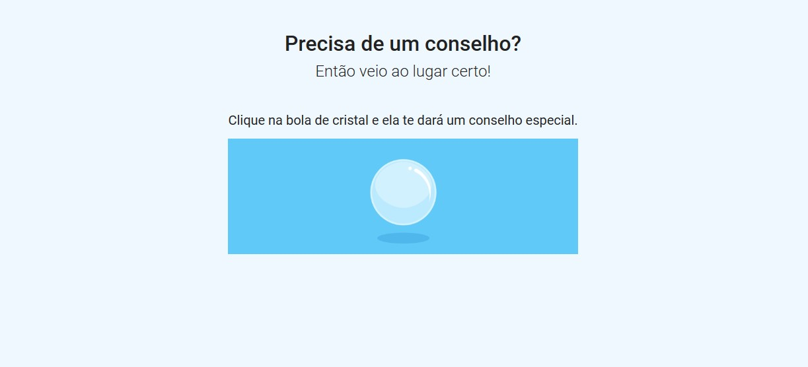
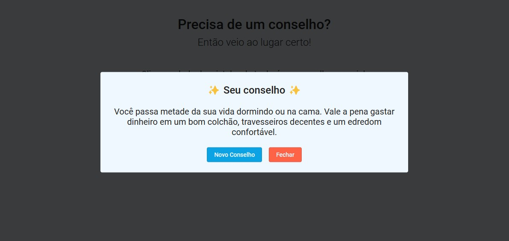

# Special Advice

É um site simples, você clica na Bola de Cristal e ela te dá um conselho. o conselho vem da api [AdviceSlip](https://api.adviceslip.com/) na lingua inglesa e eu traduzi usando a [MyMemory](https://mymemory.translated.net/), uma api de tradução.

## 🌠 Demo

<a target="_blank" href="https://u-dani.github.io/special-advice">https://u-dani.github.io/special-advice</a>

## 🛠 Tecnologias usadas

- HTML
- [TypeScript](https://www.typescriptlang.org/)
- [SASS](https://sass-lang.com/)

## Links dos conteúdos

- Favicon - <a href="https://www.flaticon.com/br/icones-gratis/bola-de-cristal" title="bola-de-cristal ícones">Bola-de-cristal ícones criados por Dreamcreateicons - Flaticon</a>
- Gif Bola de Cristal - https://br.pinterest.com/pin/475833516857964857/
